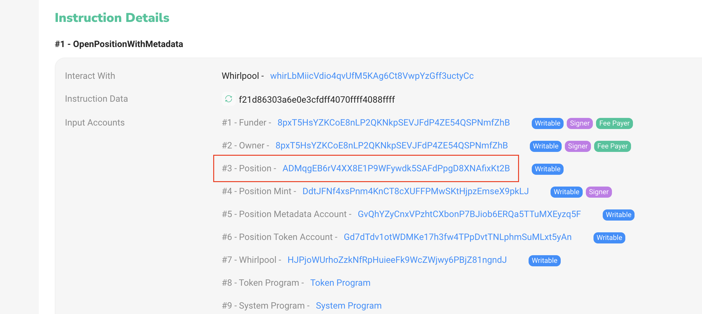
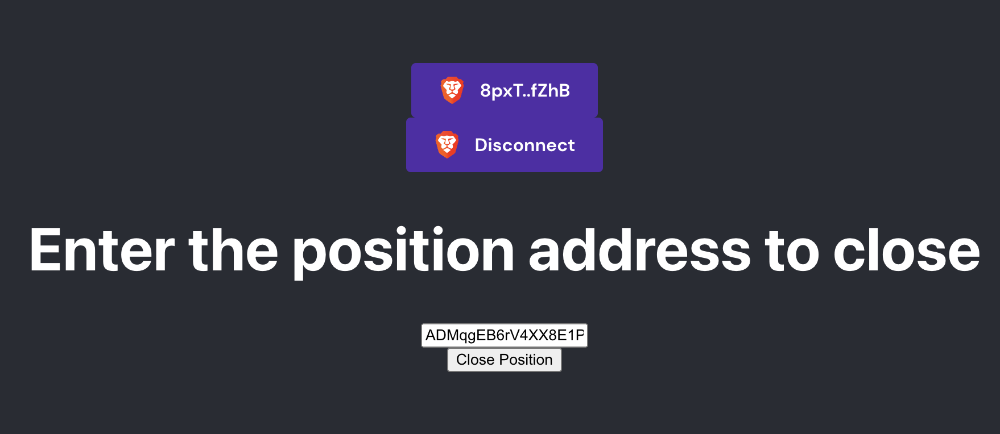

Running on dev server:

### `yarn start`

### `npm start`

How to close a position:

1) Create a whirlpools position using the UI in orca.so with the Brave Wallet
2) Run the test application and connect with the same wallet
3) Find the position address using https://solscan.io/
  - Go to the NFT mint address for your position
  - navigate to the first signature
  - the "position" will be near the beginning of the "Instruction Details" section
    
4) Paste the position address into the UI
   
5) Press the Close Position button and confirm in your wallet
